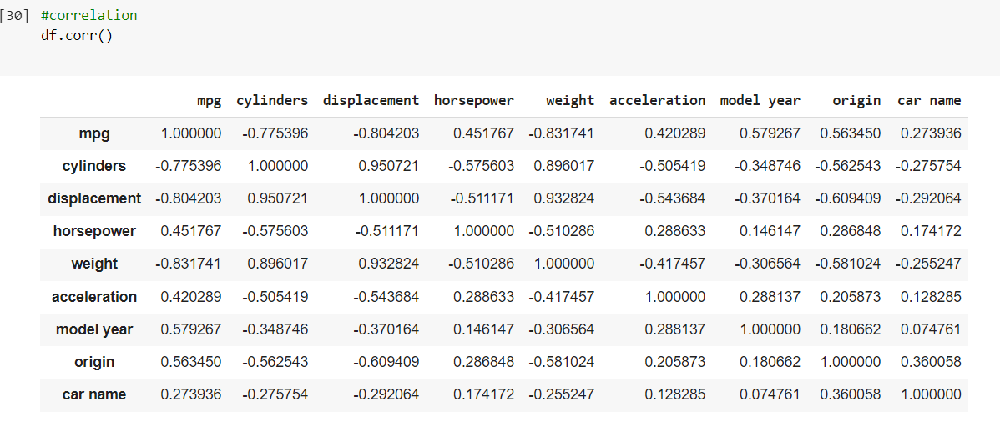

# 🚗 Car Fuel Efficiency Prediction

## 🎯 Objective
To build a regression-based machine learning model that predicts car fuel efficiency (in MPG) using various car features.

## 🛠 Tools & Technologies
- Python
- Pandas, NumPy
- Scikit-learn
- Seaborn, Matplotlib

## 🔄 Workflow
1. Data Cleaning & Preprocessing
2. Feature Engineering
3. Correlation Analysis
4. Linear Regression Model Training
5. Model Evaluation (RMSE & R² Score)

## 📊 Results
- **Model Used**: Linear Regression
- **R² Score**: 0.81 *(example, replace with your actual score)*
- **RMSE**: 3.92 *(example, replace with your actual score)*

## 📷 Sample Output



## ▶️ How to Run

```bash
# Clone the repository
git clone https://github.com/yourusername/car-fuel-efficiency.git
cd car-fuel-efficiency

# Install dependencies
pip install -r requirements.txt

# Run the notebook
jupyter notebook car_fuel_efficiency.ipynb
