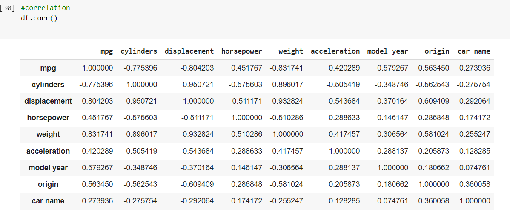
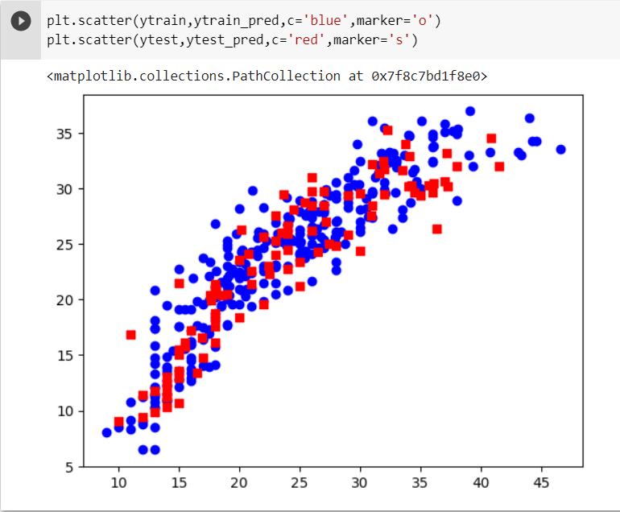

# 🚗 Car Fuel Efficiency Prediction

## 🎯 Objective
To build a regression-based machine learning model that predicts car fuel efficiency (in MPG) using various car features such as displacement, horsepower, weight, etc.

---

## 📘 Project Background

This project was part of a 5th semester internship with **Rubixe Datamite Pvt. Ltd.**, a company specializing in AI, data analytics, and machine learning. The goal was to gain hands-on experience in supervised machine learning using Python and to apply theoretical knowledge to real-world data.

The project is based on the **Auto MPG dataset**, and the task was to use regression modeling to predict a car’s fuel efficiency.

---

## 🛠 Tools & Technologies

- Python
- Pandas, NumPy
- Scikit-learn
- Seaborn, Matplotlib
- Jupyter Notebook

---

## 🔄 Workflow

1. Data Collection (UCI dataset)
2. Data Cleaning and Preprocessing
3. Correlation & Feature Analysis
4. Model Building (Linear Regression)
5. Model Evaluation (RMSE, R²)
6. Visualization of Results

---

## 🧪 Algorithms Considered

- Linear Regression ✅ *(selected for implementation)*
- Decision Trees
- Random Forest
- Support Vector Regression (SVR)
- Neural Networks

---

## 📊 Results

- **Model Used**: Linear Regression
- **R² Score**: *~0.81*
- **RMSE**: *~3.9 MPG*

---

## 💡 Findings & Limitations

### ✅ Key Findings:
- Car weight, displacement, and horsepower are key predictors of MPG.
- Linear Regression provided good baseline performance.
- Visual analysis helped detect outliers and multicollinearity.

### ⚠️ Limitations:
- Dataset was relatively small (~398 records).
- Some features like "car name" were ignored.
- Model doesn't generalize to hybrid/electric vehicles.

---

## 📷 Sample Visualizations




```python
plt.savefig('images/mpg-correlation.png')
